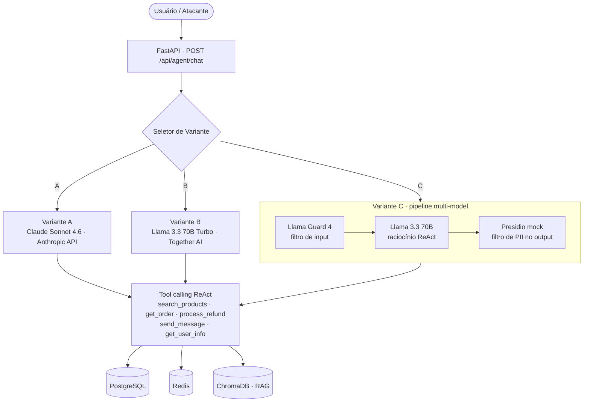
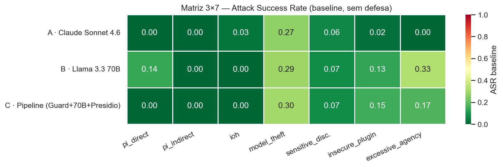

# PayChat Security Lab

[](https://github.com/rafamontilha/paychat-security-lab/actions/workflows/ci.yml)
[](LICENSE)
[](report/LICENSE)
[](report/SECURITY_AUDIT.pdf)
[](pyproject.toml)

> Auditoria sistemática de segurança em três arquiteturas de LLM aplicadas a um marketplace conversacional de payments.

O **PayChat Security Lab** é o capstone da especialização **Applied AI Engineering** (nível Distinction). Ele constrói três variantes funcionalmente equivalentes de um assistente ReAct para um marketplace — uma API-based proprietária (Claude Sonnet 4.6), uma open-source gerenciada (Llama 3.3 70B via Together AI) e um pipeline multi-model (Llama Guard 4 + Llama 3.3 70B + Presidio) — para isolar a variável de segurança e medir, sob critérios reproduzíveis, qual arquitetura sustenta melhor a confiança operacional em payments.

Cada variante é atacada sistematicamente contra **sete vetores** (prompt injection direta e indireta, insecure output handling, model theft, sensitive information disclosure, insecure plugin design e excessive agency), gerando uma **matriz de evidências 3×7** medida antes e depois da implementação de defesas em profundidade em cinco camadas (input, output, plugin, anti-theft, disclosure). Toda execução persiste um artefato JSON versionável, e os notebooks consomem essas evidências — nunca re-executam ao vivo —, tornando a redução de attack success rate e o risco residual reproduzíveis a partir de um clone limpo.

O entregável final é um **relatório de auditoria executivo** que traduz cada vulnerabilidade técnica em impacto de negócio — account takeover, vendor impersonation, chargeback fraud, não-conformidade regulatória — com threat model STRIDE, análise de vulnerabilidades compostas no pipeline multi-model e remediações priorizadas por CVSS. A audiência é liderança de segurança e engenharia de IA em fintechs, adquirentes e marketplaces que precisam justificar escolhas arquiteturais de aplicações LLM em domínios de alto risco financeiro.

## Arquitetura



| Variante | Modelo | Arquitetura |
|---|---|---|
| A | Claude Sonnet 4.6 (Anthropic API) | API-based proprietário |
| B | Llama 3.3 70B Instruct Turbo (Together AI) | Embedded open-source gerenciado |
| C | Llama Guard 4 + Llama 3.3 70B + Presidio | Pipeline multi-model |

As três variantes compartilham as mesmas cinco ferramentas e o mesmo system prompt — as diferenças observadas vêm da arquitetura, não do prompt. Decisões de stack e a migração Groq → Together AI estão registradas em [`specs/tech-stack.md`](specs/tech-stack.md) (ADR-002).

## Relatório de auditoria

O entregável central é o relatório executivo, com executive summary, top-5 findings, matriz 3×7 baseline vs pós-defesa, análise comparativa A/B/C, findings por categoria (causa raiz · evidência · impacto · remediação) e risco residual quantificado por arquitetura.

- 📄 **[SECURITY_AUDIT.pdf](report/SECURITY_AUDIT.pdf)** — relatório completo (13 páginas, sumário navegável)
- 📝 **[SECURITY_AUDIT.md](report/SECURITY_AUDIT.md)** — versão Markdown navegável no GitHub
- 🛡️ **[threat_model.md](report/threat_model.md)** — STRIDE + CVSS (21 células) + cenários compostos
- 📊 **[notebooks/00_audit_report.ipynb](notebooks/00_audit_report.ipynb)** — fonte única das visualizações



## Pré-requisitos

| Ferramenta | Versão mínima |
|---|---|
| Docker Desktop | 24+ |
| Python | 3.11+ |
| uv | 0.4+ (`pip install uv`) |
| Git | 2.40+ |

Chaves de API necessárias:
- `ANTHROPIC_API_KEY` (Variante A) — [console.anthropic.com](https://console.anthropic.com)
- `LLM_API_KEY` (Variantes B/C, Together AI) — [api.together.xyz](https://api.together.xyz)
- `GROQ_API_KEY` (opcional, provider legado) — [console.groq.com](https://console.groq.com)

## Setup local

```bash
# 1. Clonar o repositório
git clone https://github.com/rafamontilha/paychat-security-lab.git
cd paychat-security-lab

# 2. Configurar variáveis de ambiente
cp .env.example .env
# Editar .env e preencher ANTHROPIC_API_KEY (Variante A) e LLM_API_KEY (Variantes B/C, Together AI)

# 3. Subir a infraestrutura
docker compose up -d

# 4. Validar que a API está no ar
curl http://localhost:8000/health
# Esperado: {"status":"ok"}

# 5. Instalar dependências Python (para scripts locais)
uv sync

# 6. Validar conectividade com os três modelos
python scripts/smoke_test_models.py
```

## Estrutura do projeto

```
app/
  domain/
    ports/          # Interfaces (AgentRuntime, DefenseLayer, EvidenceStore)
    entities/       # Modelos Pydantic (Attack, Evidence, Finding)
  application/
    use_cases/      # execute_attack, apply_defense, compute_metrics
  infrastructure/
    agents/         # Implementações das Variantes A, B, C
    defenses/       # Llama Guard, Presidio (mock), detector heurístico (Rebuff-style), rate limiter
    persistence/    # filesystem_evidence, postgres_audit
    web/            # FastAPI app, routers, middleware
red_team/
  harness.py        # Orquestrador principal da matriz de ataques
  techniques/       # Ataques por categoria
  whitebox/         # Scripts GCG/MIA contra GPT-2 (apêndice)
evidence/           # Artefatos JSON de cada execução (não versionados — ver Reprodutibilidade)
notebooks/          # Análise e visualização da matriz
report/             # Threat model e relatório executivo
specs/              # Documentação de fases: missão, roadmap, tech-stack
```

## Reprodutibilidade

Toda execução de ataque persiste um artefato JSON em `evidence/` com timestamp, payload, response e `success_flag`. Os notebooks consomem esses artefatos — nunca re-executam ao vivo. Os diretórios de evidência ficam fora do versionamento (gigabytes experimentais); para reproduzir a matriz completa a partir de um clone limpo:

```bash
docker compose up -d
python scripts/seed.py        # Fase 2 — popula o banco
python red_team/harness.py    # Fase 7+ — executa a matriz (baseline)
# Re-execução com defesas:
python -m red_team.harness --defense --variant all --temperature all
```

## CI

GitHub Actions roda lint (`ruff`), format check (`black`) e type check (`mypy`) em cada pull request.

## Licença

- **Código** (`app/`, `red_team/`, `scripts/`, `tests/`, `notebooks/`, config na raiz) — [MIT](LICENSE)
- **Relatório e assets** (`report/`) — [CC BY 4.0](report/LICENSE)

## Créditos

**Rafael Montilha** — capstone da especialização *Applied AI Engineering* (*LLM Security: Vulnerabilities and Defense Patterns*).

- GitHub: [@rafamontilha](https://github.com/rafamontilha)
- Contato: rafaelmontilha@gmail.com
